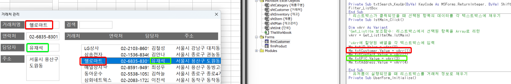

#### A. DB구조 이해

> [!NOTE] 오빠두가 제공하는 DB 함수
> 
> | **함수**                                                                             | **설명**                                                                |
> | ------------------------------------------------------------------------------------ | ----------------------------------------------------------------------- |
> | [**Insert_Record**](https://www.oppadu.com/vba-get-db-%ed%95%a8%ec%88%98/)           | 시트에 새로운 행을 추가합니다.                                          |
> | [**Update_Record**](https://www.oppadu.com/vba-update-record-%ed%95%a8%ec%88%98/)    | 시트에서 특정 ID를 갖는 데이터를 갱신 합니다.                           |
> | [**Delete_Record**](https://www.oppadu.com/vba-delete-record-%ed%95%a8%ec%88%98/)    | 시트에서 특정 ID를 갖는 데이터를 삭제합니다.                            |
> | [**Get_DB**](https://www.oppadu.com/vba-get-db-%ed%95%a8%ec%88%98/)                  | 시트에 범위로 입력된 데이터를 배열로 반환합니다.                        |
> | [**Connect_DB**](https://www.oppadu.com/vba-connect-db-%eb%aa%85%eb%a0%b9%eb%ac%b8/) | 기존 배열과 새로운 시트를 연결한 관계형 DB를 배열로 반환합니다.         |
> | [**Filtered_DB**](https://www.oppadu.com/vba-filtered-db-%ed%95%a8%ec%88%98/)        | 배열에서 특정 조건을 만족하는 값만 필터링하여 새로운 배열로 반환합니다. |
>  


#### B. 유저폼 활용
##### (1) 유저폼 기초
###### i. view
- 거래처 관리 폼 만들기


- 거래처 관리 폼 나오게 하기


###### ii. read
- 거래처 sheet 데이터 가져오기
-  리스트박스 선택시 텍스트박스 자동완성

###### iii. update
- record 업데이트


- 초기화 버튼 활성화


- 등록 버튼 활성화


- 등록 유효성 검증


- 삭제 버튼 활성화


```VB
'########################
' 시트에서 ID 를 갖는 레코드 삭제
' Delete_Record Sheet1, ID
'########################
Sub Delete_Record(WS As Worksheet, ID)

Dim cRow As Long

If IsNumeric(ID) = True Then ID = CLng(ID)

With WS
    cRow = get_UpdateRow(WS, ID)
    .Cells(cRow, 1).EntireRow.Delete
End With

End Sub
```

- 삭제버튼 확인문구 추가


- 검색, 닫기 활성화

##### (2) 콤보박스, 리스트박스


> [!NOTE] 오빠두가 제공하는 리스트박스/콤보박스/유저폼 함수
> 
> | **함수**                                                                                                                                          | **설명**                                              |
> | ------------------------------------------------------------------------------------------------------------------------------------------------- | ----------------------------------------------------- |
> | **Update_Cbo**                                                                                                                                    | DB 데이터를 콤보박스에 추가합니다.                    |
> | **Select_CboItm**                                                                                                                                 | 여러 필드로 입력된 콤보박스에서 특정 값을 선택합니다. |
> | **Update_List**                                                                                                                                   | DB 데이터를 리스트박스에 추가합니다.                  |
> | **Get_ListItm**                                                                                                                                   | 리스트박스 목록을 DB로 반환합니다.                    |
> | **Select_ListItm**                                                                                                                                | 특정 ID를 갖는 리스트박스 값을 배열로 반환합니다.     |
> | **Active_ListBox**                                                                                                                                | 리스트박스를 활성화합니다.                            |
> | **Get_ListIndex**                                                                                                                                 | 현재 리스트박스에서 선택된 값의 순번을 반환합니다.    |
> | [**isListBoxSelected**](https://www.oppadu.com/vba-%eb%a6%ac%ec%8a%a4%ed%8a%b8%eb%b0%95%ec%8a%a4-%ea%b0%92-%ec%84%a0%ed%83%9d%ec%97%ac%eb%b6%80/) | 리스트박스가 현재 활성화되어 있는지 확인합니다.       |
> | **Clear_Ctrls**                                                                                                                                   | 선택한 컨트롤의 값을 모두 초기화합니다.               |
> | **IsEmpty_Ctrls**                                                                                                                                 | 선택한 컨트롤의 값이 모두 입력되어 있는지 확인합니다. |


##### (3) 

> [!NOTE] 오빠두가 제공하는 유저폼 마우스 휠 기능 함수
> 
> |**함수**|**설명**|
> |---|---|
> |**HookListBoxScroll**|리스트박스의 마우스 휠 스크롤을 활성화 합니다.  <br>(MouseMove 이벤트에 추가합니다.)|
> |**UnHookListBoxScroll**|리스트박스에 적용된 마우스 휠 이동을 비활성화 합니다.  <br>(Exit 이벤트에 추가합니다.)|


#### B. 드롭다운/목록, 유저폼 활용
- 서로 다른 두 유저폼 연동하여 사용하기
- 유저폼 內 콤보박스와 리스트박스

#### C. VBA 기초, 유저폼 최종
> [!NOTE] 오빠두가 제공하는 array/range handling 함수
> 
> | **함수**                                                                                                                            | **설명**                                                               |
> | ----------------------------------------------------------------------------------------------------------------------------------- | ---------------------------------------------------------------------- |
> | [**Sort2dArray**](https://www.oppadu.com/%ec%97%91%ec%85%80-2%ec%b0%a8%ec%9b%90-%eb%b0%b0%ec%97%b4-%ec%a0%95%eb%a0%ac-sort2darray/) | 2차원 배열을 특정 필드 기준으로 오름차순/내림차순 정렬합니다.          |
> | **IsUniqueArray**                                                                                                                   | 각 배열이 하나의 값으로만 이루어져 있는지 확인합니다. (예: 1,1,1,1..)  |
> | **IsDistinctArray**                                                                                                                 | 각 배열이 고유값으로 이루어져 있는지 확인합니다. (예: 1,2,3,4..)       |
> | [**ArrayToRng**](https://www.oppadu.com/vba-arraytorng-%ed%95%a8%ec%88%98/)                                                         | DB 배열을 시트 범위로 출력합니다.                                      |
> | **SequenceToRng**                                                                                                                   | 시트 범위 위로 순번을 출력합니다.                                      |
> | **ValueToRng**                                                                                                                      | 시트 범위 위로 정해진 값을 출력합니다.                                 |
> | **RunningSumRng**                                                                                                                   | 시작 셀을 기준으로 더할 곳(+)과 뺄 곳(-)을 지정하여 누계를 계산합니다. |
> | **ShapeInRange**                                                                                                                    | 지정한 범위가 강조 되도록 범위 위에 도형을 삽입합니다.                 |
> | **ClearContentsBelow**                                                                                                              | 지정한 범위 아래로 입력된 데이터를 초기화합니다.                       |
>
