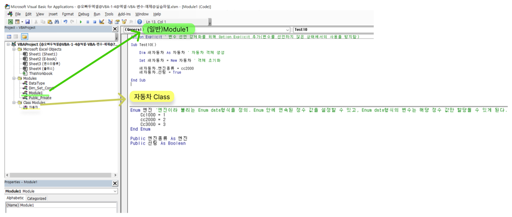
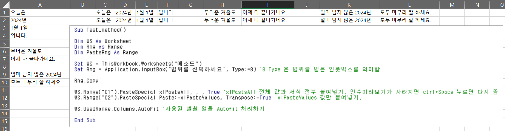

### 단축키 정리

VBA editor: Alt F11
VBA executing: F5
VBA debugging : F8
Object explain in VBA editor: F2 in VBA editor
See Properties of Class in VBA editor: F4

### Class 정리

### Method 정리

### FolderDialog method 정리

`Multiple_FileDialog ( Title, FilterName, FilterExt, InitialFolder, InitialView, MultiSelection, PathDelimiter, withPath, withExt )

- Title : 엑셀 파일선택창에 보이는 제목입니다.
- FilterName : 확장자 필터에 표시될 필터 이름입니다.
- FilterExt : 파일선택창에 출력될 확장자를 필터링합니다
- InitialFolder : 파일선택창의 시작 경로입니다.
- InitialView : 파일선택창이 실행되었을 때 어떻게 보여질지 출력방식을 결정합니다. 
- MultiSelection : TRUE일 경우 여러개의 파일을 선택할 수 있습니다. (기본값: TRUE)
- PathDelimiter : 여러개의 파일을 구분할 구분자입니다. 특별한 상황을 제외하고 기본값을 유지합니다. (기본값 : "|")
- withPath : TRUE일 경우 파일경로를 함께 출력합니다. (기본값: TRUE)
- withExt : TRUE일 경우 파일확장자를 함께 출력합니다. (기본값: TRUE)